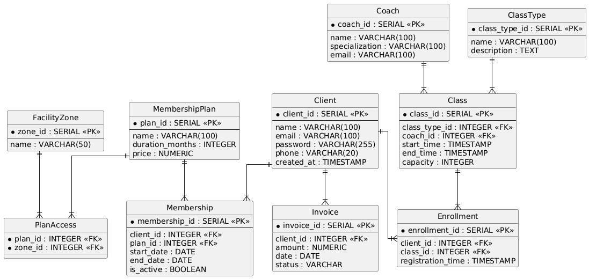

# Документація схеми бази даних

## Діаграма сутність-зв'язок (Entity-Relationship Diagram)

## Опис таблиць

### **Таблиця: FacilityZone**

**Призначення:** Довідник зон закладу (наприклад, тренажерний зал, басейн, сауна).

| Стовпець | Тип | Обмеження | Опис |
| :---- | :---- | :---- | :---- |
| zone\_id | INTEGER | PRIMARY KEY, SERIAL | Унікальний ідентифікатор зони |
| name | VARCHAR(50) | UNIQUE, NOT NULL | Назва зони |

**Індекси:**

* facilityzone\_pkey на zone\_id  
* facilityzone\_name\_key на name (забезпечує унікальність назв)

**Зв'язки:**

* Один-до-багатьох з PlanAccess (одна зона може входити до багатьох планів).

### **Таблиця: MembershipPlan**

**Призначення:** Зберігає доступні тарифні плани (абонементи).

| Стовпець | Тип | Обмеження | Опис |
| :---- | :---- | :---- | :---- |
| plan\_id | INTEGER | PRIMARY KEY, SERIAL | Унікальний ідентифікатор плану |
| name | VARCHAR(100) | UNIQUE, NOT NULL | Назва тарифного плану |
| duration\_months | INTEGER | NOT NULL, CHECK (\>0) | Тривалість дії плану в місяцях |
| price | NUMERIC(10,2) | NOT NULL, CHECK (\>0) | Вартість плану |

**Індекси:**

* membershipplan\_pkey на plan\_id  
* membershipplan\_name\_key на name

**Зв'язки:**

* Один-до-багатьох з Membership (один план можуть купити багато клієнтів).  
* Один-до-багатьох з PlanAccess (один план надає доступ до багатьох зон).

### **Таблиця: Client**

**Призначення:** Зберігає персональні дані та облікові записи клієнтів.

| Стовпець | Тип | Обмеження | Опис |
| :---- | :---- | :---- | :---- |
| client\_id | INTEGER | PRIMARY KEY, SERIAL | Унікальний ідентифікатор клієнта |
| name | VARCHAR(100) | NOT NULL | ПІБ клієнта |
| email | VARCHAR(100) | UNIQUE, NOT NULL | Електронна пошта (логін), перевірка формату '@' |
| password | VARCHAR(255) | NOT NULL | Хешований пароль |
| phone | VARCHAR(20) | UNIQUE, NOT NULL | Номер телефону |
| created\_at | TIMESTAMP | DEFAULT CURRENT\_TIMESTAMP | Дата реєстрації |

**Індекси:**

* client\_pkey на client\_id  
* client\_email\_key на email  
* client\_phone\_key на phone

**Зв'язки:**

* Один-до-багатьох з Membership (історія абонементів).  
* Один-до-багатьох з Invoice (історія платежів).  
* Один-до-багатьох з Enrollment (записи на заняття).

### **Таблиця: Coach**

**Призначення:** Зберігає інформацію про тренерський склад.

| Стовпець | Тип | Обмеження | Опис |
| :---- | :---- | :---- | :---- |
| coach\_id | INTEGER | PRIMARY KEY, SERIAL | Унікальний ідентифікатор тренера |
| name | VARCHAR(100) | NOT NULL | ПІБ тренера |
| specialization | VARCHAR(100) | NOT NULL | Спеціалізація (наприклад, Йога, Кросфіт) |
| email | VARCHAR(100) | UNIQUE, NOT NULL | Електронна пошта, перевірка формату '@' |
| password | VARCHAR(255) | NOT NULL | Хешований пароль для входу в систему |
| created\_at | TIMESTAMP | DEFAULT CURRENT\_TIMESTAMP | Дата додавання до системи |

**Індекси:**

* coach\_pkey на coach\_id  
* coach\_email\_key на email

**Зв'язки:**

* Один-до-багатьох з Class (тренер проводить багато занять).

### **Таблиця: ClassType**

**Призначення:** Довідник типів занять.

| Стовпець | Тип | Обмеження | Опис |
| :---- | :---- | :---- | :---- |
| class\_type\_id | INTEGER | PRIMARY KEY, SERIAL | Ідентифікатор типу заняття |
| name | VARCHAR(100) | UNIQUE, NOT NULL | Назва заняття (наприклад, Паверліфтинг) |
| description | TEXT | NULL | Опис заняття |

**Індекси:**

* classtype\_pkey на class\_type\_id  
* classtype\_name\_key на name

**Зв'язки:**

* Один-до-багатьох з Class (один тип заняття може проводитись багато разів).

### **Таблиця: PlanAccess**

**Призначення:** Проміжна таблиця для реалізації зв'язку Many-to-Many між планами та зонами доступу (1NF).

| Стовпець | Тип | Обмеження | Опис |
| :---- | :---- | :---- | :---- |
| plan\_id | INTEGER | PK, FK, NOT NULL | Посилання на MembershipPlan |
| zone\_id | INTEGER | PK, FK, NOT NULL | Посилання на FacilityZone |

**Індекси:**

* planaccess\_pkey на (plan\_id, zone\_id) (складений первинний ключ)  
* IX\_planaccess\_zone\_id на zone\_id

**Зв'язки:**

* Багато-до-одного до MembershipPlan (ON DELETE CASCADE).  
* Багато-до-одного до FacilityZone (ON DELETE CASCADE).

### **Таблиця: Membership**

**Призначення:** Фіксує факт купівлі абонемента клієнтом (активні та архівні підписки).

| Стовпець | Тип | Обмеження | Опис |
| :---- | :---- | :---- | :---- |
| membership\_id | INTEGER | PRIMARY KEY, SERIAL | Ідентифікатор підписки |
| client\_id | INTEGER | FK, NOT NULL | Посилання на Client |
| plan\_id | INTEGER | FK, NOT NULL | Посилання на MembershipPlan |
| start\_date | DATE | NOT NULL | Дата початку дії |
| end\_date | DATE | NOT NULL, CHECK (\>start) | Дата закінчення дії |
| is\_active | BOOLEAN | DEFAULT TRUE | Статус активності абонемента |

**Індекси:**

* membership\_pkey на membership\_id  
* IX\_membership\_client\_id на client\_id  
* IX\_membership\_plan\_id на plan\_id

**Зв'язки:**

* Багато-до-одного до Client (ON DELETE CASCADE).  
* Багато-до-одного до MembershipPlan (ON DELETE RESTRICT).

### **Таблиця: Invoice**

**Призначення:** Фінансова інформація про платежі клієнтів.

| Стовпець | Тип | Обмеження | Опис |
| :---- | :---- | :---- | :---- |
| invoice\_id | INTEGER | PRIMARY KEY, SERIAL | Ідентифікатор рахунку |
| client\_id | INTEGER | FK, NOT NULL | Посилання на Client |
| amount | NUMERIC(10,2) | NOT NULL, CHECK (\>0) | Сума платежу |
| date | DATE | DEFAULT CURRENT\_DATE | Дата виставлення рахунку |
| status | VARCHAR(20) | DEFAULT 'pending' | Статус (pending, paid, overdue, cancelled) |
| payment\_method | VARCHAR(50) | CHECK IN list | Метод (cash, card, bank\_transfer, online) |
| notes | TEXT | NULL | Додаткові примітки |

**Індекси:**

* invoice\_pkey на invoice\_id  
* IX\_invoice\_client\_id на client\_id

**Зв'язки:**

* Багато-до-одного до Client (ON DELETE CASCADE).

### **Таблиця: Class**

**Призначення:** Розклад конкретних занять у часі.

| Стовпець | Тип | Обмеження | Опис |
| :---- | :---- | :---- | :---- |
| class\_id | INTEGER | PRIMARY KEY, SERIAL | Ідентифікатор заняття у розкладі |
| class\_type\_id | INTEGER | FK, NOT NULL | Посилання на тип заняття |
| coach\_id | INTEGER | FK, NOT NULL | Посилання на тренера |
| start\_time | TIMESTAMP | NOT NULL | Час початку |
| end\_time | TIMESTAMP | NOT NULL, CHECK (\>start) | Час закінчення |
| capacity | INTEGER | NOT NULL, CHECK (0-50) | Максимальна кількість учасників |

**Індекси:**

* class\_pkey на class\_id  
* IX\_class\_class\_type\_id на class\_type\_id  
* IX\_class\_coach\_id на coach\_id

**Зв'язки:**

* Багато-до-одного до ClassType.  
* Багато-до-одного до Coach.  
* Один-до-багатьох з Enrollment.

### **Таблиця: Enrollment**

**Призначення:** Реєстрація клієнтів на конкретні заняття.

| Стовпець | Тип | Обмеження | Опис |
| :---- | :---- | :---- | :---- |
| enrollment\_id | INTEGER | PRIMARY KEY, SERIAL | Ідентифікатор запису |
| client\_id | INTEGER | FK, NOT NULL | Посилання на Client |
| class\_id | INTEGER | FK, NOT NULL | Посилання на Class |
| registration\_time | TIMESTAMP | DEFAULT NOW() | Час створення запису |

**Індекси:**

* enrollment\_pkey на enrollment\_id  
* IX\_enrollment\_class\_id на class\_id  
* enrollment\_client\_id\_class\_id\_key (UNIQUE) — запобігає дублюванню запису клієнта на те саме заняття.

**Зв'язки:**

* Багато-до-одного до Client (ON DELETE CASCADE).  
* Багато-до-одного до Class (ON DELETE CASCADE).